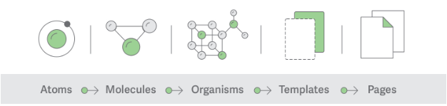

# A Developers Guide to Shortly - FE

## Project Architecture

### Component Design

[Atomic Design Methodology](https://atomicdesign.bradfrost.com/chapter-2/) has been used to create components. It was developed by Brad Frost and Dave Olsen, and is a methodology for crafting design systems with five fundamental building blocks, which, when combined, promote consistency, modularity, and scalability.



### Service Design

Each Interaction that pertains to pulling data from outside the application, should be communicated via a dedicated service. The service is responsible for making API calls, storing data in browser etc.

A custom `useService` hook can be used to exectute the functions from inside React components.

## Code / Folder Structure

Each Atom, moulecule etc. will have it's own folder. And each folder will have its own `index.ts` to help import modules with ease.

Each modules folder, will have all the elements it needs. A good check for this is to see if a folder is plugged into another directory, will it work? If yes - we're fine.

#### Implementation Example

```
app/
|--- atoms
    |--- Text
        |--- index.ts
        |--- styles.ts
        |--- types.ts
        |--- Text.ts
        |--- Text.spec.ts
    |--- Button
        |--- index.ts
        |--- styles.ts
        |--- types.ts
        |--- Button.ts
        |--- Button.spec.ts
    index.ts
|--- molecules
    |--- Link
        |--- index.ts
        |--- styles.ts
        |--- types.ts
        |--- Link.ts
        |--- Link.spec.ts
    |--- FeatureCard
        |--- index.ts
        |--- styles.ts
        |--- types.ts
        |--- FeatureCard.ts
        |--- FeatureCard.spec.ts
    index.ts
```

As a result, this is possible: `import { Button, ButtonSizes, ButtonTypes, uttonVariants, Image, TextVariants,} from '../../../../atoms';`

## Linting

Eslint, Prettier and StyleLint have been used. Liniting is also enforced by [Husky](https://www.npmjs.com/package/husky) via pre-commit hooks.

- [ESLint](http://eslint.org/)
- [Prettier](https://prettier.io/)
- [Stylelint](https://stylelint.io/)

### Unit Testing

- [react-testing-library](https://github.com/testing-library/react-testing-library)

## Commit Messages

This project uses [commitlint](https://github.com/conventional-changelog/commitlint) for formating the commit messages. Check here for understanding the commit message format (or take a look at the commit history).
